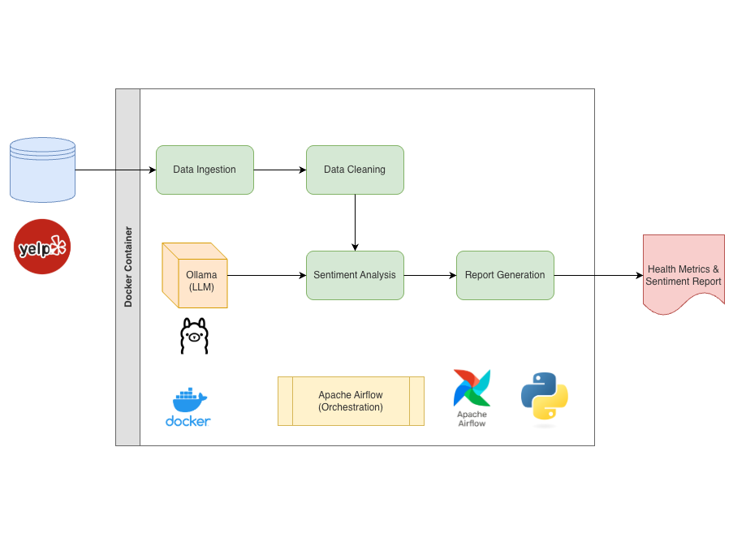

# AI Sentiment Analysis Data Pipeline
This project inplements a small-scale data pipeline which ingests Yelp customer reviews, applies data cleaning, integrates AI generated sentiments of reviews, and exports a report of the results.


## Architecture


## Overview

1. **Data Cleaning** identifies and fixes data quality issues
2. **Processes** sentiment analysis using local LLM (Ollama)
3. **Reports** detailed health metrics and healing statistics

## Sample Yelp Review Data Structure
```
{
  "review_id": "J-4NdnDZ0pUQaUEEwDI9KQ",
  "user_id": "vrKkXsozqqecF3CW4cGaVQ",
  "business_id": "rjuWz_AD3WfXJc03AhIO_w",
  "stars": 5,
  "useful": 2,
  "funny": 2,
  "cool": 2,
  "text": "I thoroughly enjoyed the show.  Chill way to spend a Friday night.",
  "date": "2012-12-04 16:46:20"
}
```

## Setup Steps

Create the requires setup files and folders:
```
mkdir -p ./dags ./logs ./plugins ./config
echo -e "AIRFLOW_UID=$(id -u)" > .env
```

Build the Python container with added dependencies:
``docker compose build``

Initialize the Airflow configuration:
```docker compose up airflow-init```

After initialization is complete, you should see output related to files, folders, and plug-ins and finally a message like this:
```airflow-init-1 exited with code 0```
The account created has the login airflow and the password airflow.

Now you can start all services:
```docker compose up```

Airflow UI can be viewed in the browser using:
http://localhost:8080/

## Cleaning up
To stop and delete containers, delete volumes with database data and download images, run:
```docker compose down --volumes --rmi all```

## References
- Yelp dataset https://business.yelp.com/data/resources/open-dataset/
- https://airflow.apache.org/docs/apache-airflow/stable/howto/docker-compose/index.html
- [Building custom Docker images](https://airflow.apache.org/docs/docker-stack/build.html#building-the-image)
- [Adding packages to airflow Docker base image](https://airflow.apache.org/docs/docker-stack/build.html)